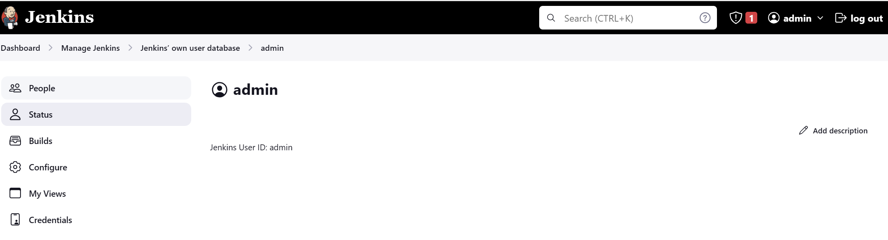
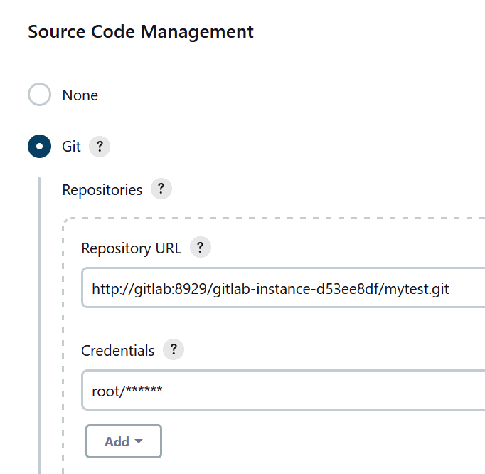

# cicd-jenkins-k8s
Setup CI/CD with Jenkins on Docker Desktop

## 1. Install Git on WSL2

    git --version

    git version 2.25.1

    ifconfig

    172.22.216.211

## 2. Install GitLab on WSL2

    docker search gitlab
    docker pull gitlab/gitlab-ce

    sudo mkdir -p /data/git
    sudo nano /data/git/docker-compose.yml

    cd /data/git
    docker-compose up -d

Restart if needed:

    docker-compose restart

## 3. Access Gitlab from Windows

    http://localhost:8929

Check the intial password for user "root":

    docker exec -it gitlab cat /etc/gitlab/initial_root_password

Login and change the password for the first time.

If needed, reset gitlab in the following steps:

    cd /data/git
    docker-compose rm
    sudo rm -r config/
    sudo rm -r data/
    sudo rm -r logs/
    docker-compose up -d
    docker exec -it gitlab cat /etc/gitlab/initial_root_password

## 4. Create a Spring Boot project: mytest

Rename

    http://172.22.217.132:8929/gitlab-instance-d53ee8df/mytest.git

To

    http://localhost:8929/gitlab-instance-d53ee8df/mytest.git

Commit and push a local repository to the above remote repo:

## 5. Install Jenkins by customising official Jenkins Docker image

Create Dockerfile jenkins/Dockerfile.
Build a new docker image from this Dockerfile and assign the image a meaningful name, e.g. "myjenkins-blueocean:2.387.3-1":

    docker build -t myjenkins-blueocean:2.387.3-1 .

Run your own myjenkins-blueocean:2.387.3-1 image as a container in Docker using the following command in jenkins/setup-jenkins-by-docker.txt.

## 6. Configure Jenkins

Jenkins initial setup is required. An admin user has been created and a password generated at /var/jenkins_home/secrets/initialAdminPassword

Access jenkins from http://localhost:8090

Modified compose/docker-compose-jenkins.yml to port from 8080 to 8090. Access jenkins from http://localhost:8090.

## 7. Install Jenkins plugin "Publish Over SSH"

After install the plugin, confiured and tested as below:

## 8. Create a docker network

    docker network create devops-network
    docker network inspect devops-network
    docker network connect devops-network jenkins-blueocean
    docker network connect devops-network gitlab
    docker container inspect gitlab
    docker container inspect jenkins-blueocean

## 9. Create a Freestyle project "mybuild"

The containers can communicate with each other using Name or IPv4Address

## 10. Access Jenkins container

    docker container exec -it jenkins-blueocean bash

## 11. Run the build

